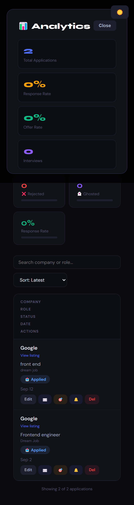
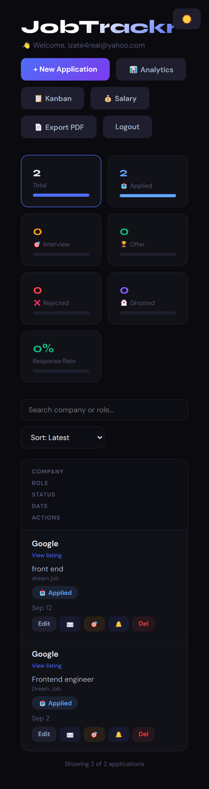
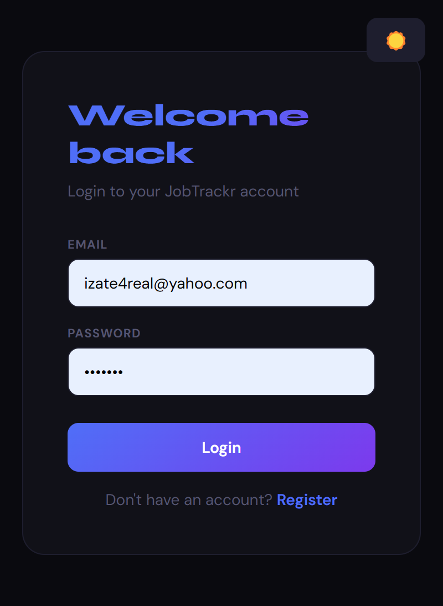
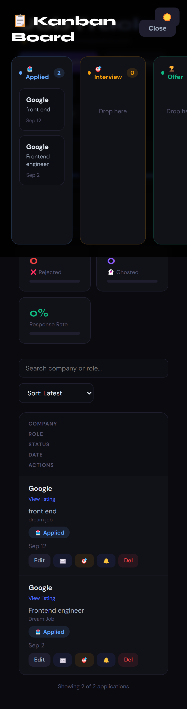
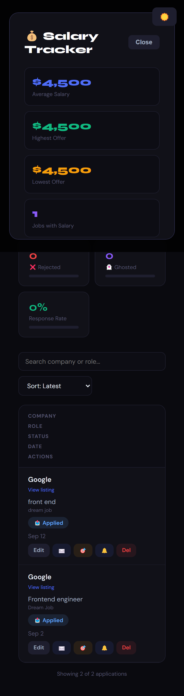

# JobTrackr 🚀

A senior-level full-stack job application tracker with AI-powered features.

**Live Demo:** https://job-tracker-gray-rho.vercel.app

## Screenshots









## Features

- ✅ JWT Authentication (Login/Register)
- ✅ Add/Edit/Delete Job Applications
- ✅ Status Tracking (Applied, Interview, Offer, Rejected, Ghosted)
- ✅ Analytics Dashboard with Charts
- ✅ Kanban Board with Drag & Drop
- ✅ Salary Tracker & Comparison Chart
- ✅ AI Cover Letter Generator (OpenAI)
- ✅ AI Interview Prep Questions (OpenAI)
- ✅ Email Reminders (Nodemailer)
- ✅ Export to PDF
- ✅ Dark/Light Mode
- ✅ Fully Responsive (Mobile Friendly)

## Tech Stack

**Frontend:** React, Axios, Recharts, jsPDF

**Backend:** Node.js, Express, PostgreSQL, JWT, Nodemailer, OpenAI

**Deployment:** Vercel (frontend) + Railway (backend + database)

## Getting Started

### 1. Clone the repo
\```bash
git clone https://github.com/Josueize/job-tracker.git
cd job-tracker
\```

### 2. Install dependencies
\```bash
npm install
\```

### 3. Create `.env` file
\```
PORT=5001
OPENAI_API_KEY=your_openai_key
EMAIL_USER=your_email
EMAIL_PASS=your_app_password
\```

### 4. Start the backend
\```bash

\```

### 5. Start the frontend
\```bash
npm start
\```

## Author

**Izehiuwa Igiebor (Josue)**
- GitHub: [@Josueize](https://github.com/Josueize)
- Live: [job-tracker-gray-rho.vercel.app](https://job-tracker-gray-rho.vercel.app)